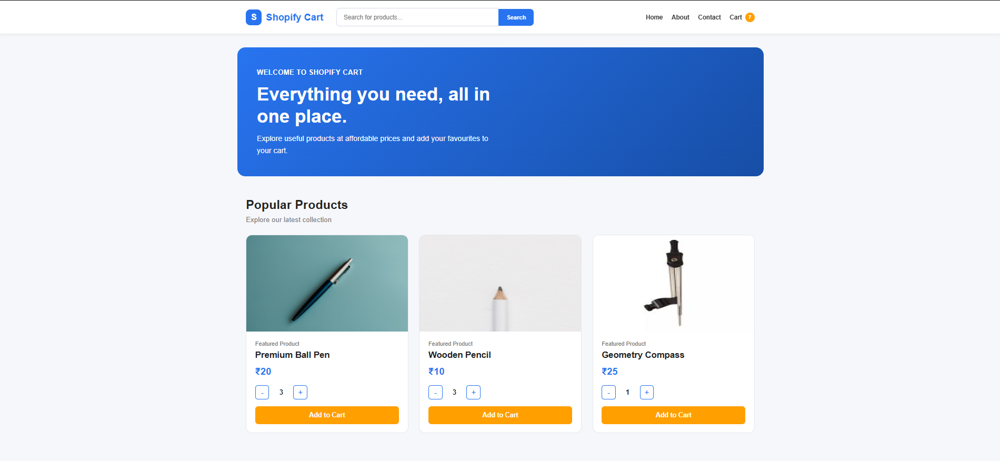

# React JS Workshop E-Commerce Project

A responsive e-commerce cart website developed using React JS as the final project of a 5-day React JS workshop organized by the React Rajasthan Community at Poornima University.

The project demonstrates the practical use of React components, routing, props, state management, and cart functionality.

## 📸 Project Preview

### Homepage



## 🚀 Features

- Responsive e-commerce homepage
- Product listing with product images, names, and prices
- Add products to the cart
- Remove products from the cart
- Increase and decrease product quantity
- Display total cart items
- Calculate total cart price
- Navigation between different pages
- Separate Home, About, Contact, and Cart pages
- Reusable React components
- Component communication using props
- State management using React Hooks

## 🛠️ Technologies Used

- HTML5
- CSS3
- JavaScript
- React JS
- React Router
- Vite
- JSX

## 📂 Project Structure

```text
Work/
│
├── public/
├── src/
│   ├── components/
│   │   ├── About/
│   │   ├── Cart/
│   │   ├── Contact/
│   │   ├── Footer/
│   │   ├── Header/
│   │   └── Home/
│   │
│   ├── App.jsx
│   ├── index.css
│   └── main.jsx
│
├── index.html
├── package.json
├── package-lock.json
└── README.md
```

## ⚙️ Installation and Setup

### 1. Clone the repository

```bash
git clone https://github.com/Ashish-1628/React-Js-Workshop-Project.git
```

### 2. Open the project folder

```bash
cd React-Js-Workshop-Project
```

### 3. Install dependencies

```bash
npm install
```

### 4. Start the development server

```bash
npm run dev
```

Open the local URL shown in the terminal, usually:

```text
http://localhost:5173
```

## 🧠 React Concepts Practiced

- Functional components
- JSX
- Props
- `useState` Hook
- Event handling
- Conditional rendering
- Array methods such as `map()` and `reduce()`
- Component communication
- React Router
- Dynamic cart updates
- Responsive styling

## 🛒 Cart Functionality

Users can:

1. View available products.
2. Add products to the cart.
3. Increase or decrease product quantities.
4. Remove products from the cart.
5. View the total number of items.
6. View the total price of the cart.

## 📚 Learning Outcomes

Through this project, I improved my understanding of:

- Building user interfaces with React JS
- Creating reusable components
- Managing and sharing state between components
- Implementing navigation using React Router
- Handling user interactions
- Structuring a frontend project
- Developing a functional e-commerce interface

## 👨‍🏫 Workshop Information

This project was created as part of a 5-day React JS workshop organized by:

- React Rajasthan Community
- Poornima University

The workshop was conducted under the guidance of:

- Shubham Gupta
- Kiran Choudhary

## 🔮 Future Improvements

- Product search and filtering
- Product categories
- Product details page
- User authentication
- Backend integration
- Database connectivity
- Online payment integration
- Order history
- Wishlist functionality
- Deployment on Vercel or Netlify

## 👤 Author

**Ashish**

MCA Student | React JS Learner | Frontend Development Enthusiast

## 📄 License

This project was created for learning and educational purposes.